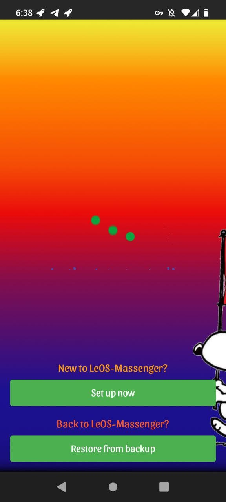
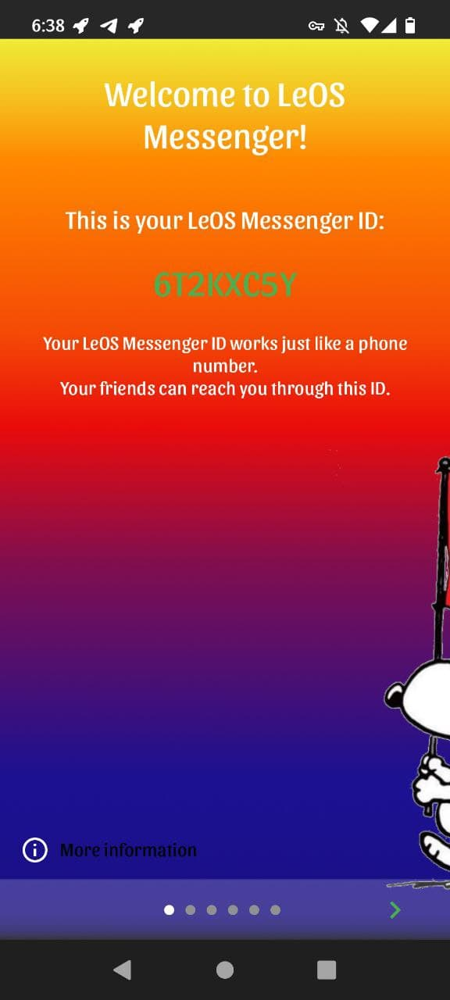
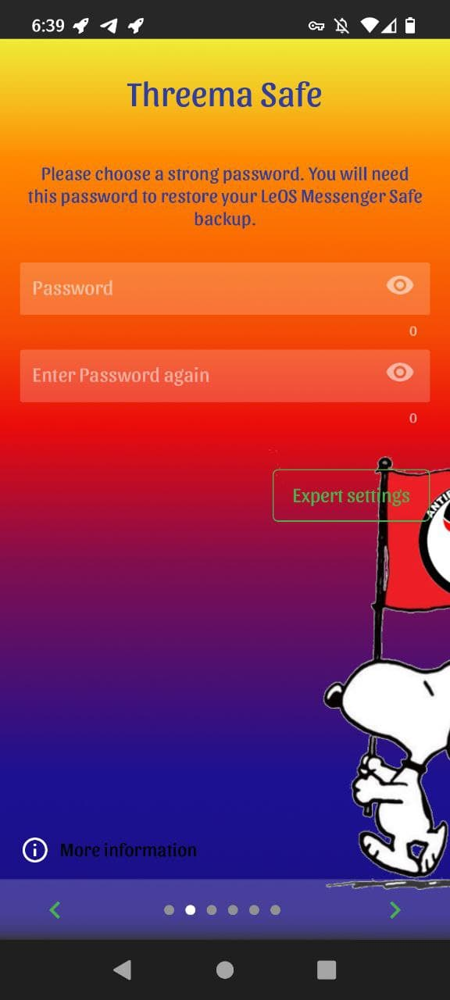
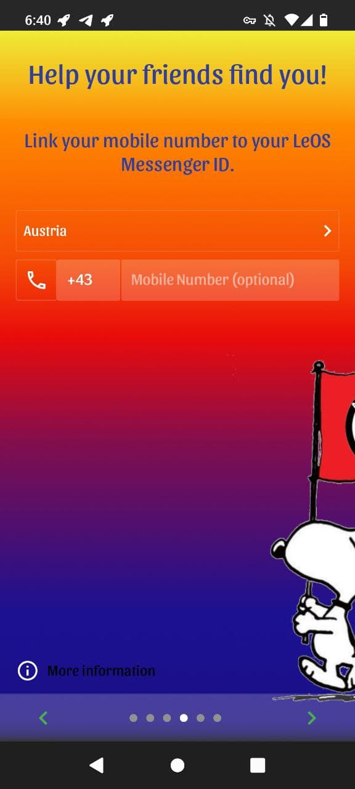
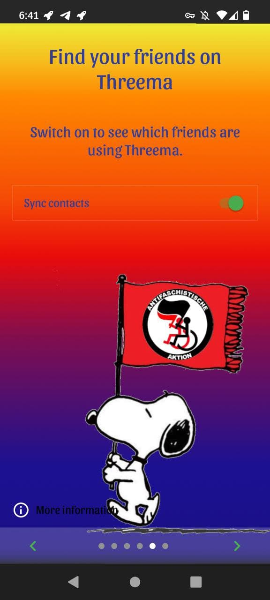
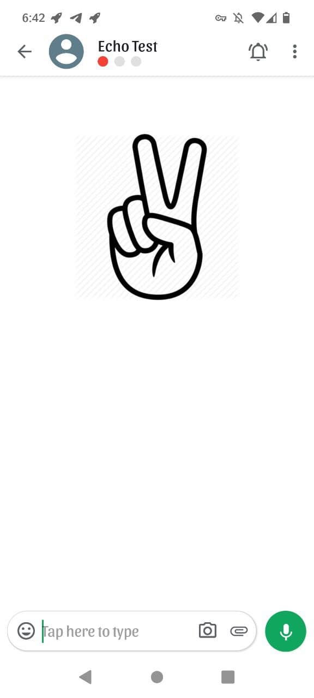

Screenshots available here: https://gitlab.com/leos1/leos-wiki/-/wikis/LeOS-Messenger-Setup-Wizard

# LeOS-Messenger for Android

This repository contains the complete source code of LeOS-Messenger a fork of
[Threema](https://threema.ch/) for Android.

## ⚠ Join us on Telegram (https://t.me/LeOS_Support)

## Screenshots
### LogIn screen
|  |  |  |
|  |  |  |
|  |  |  |
|:---:|:---:|:---:|

### Wallpaper lite / dark
| | 
|:---:|:---:|:---:|:---:|:---:|
